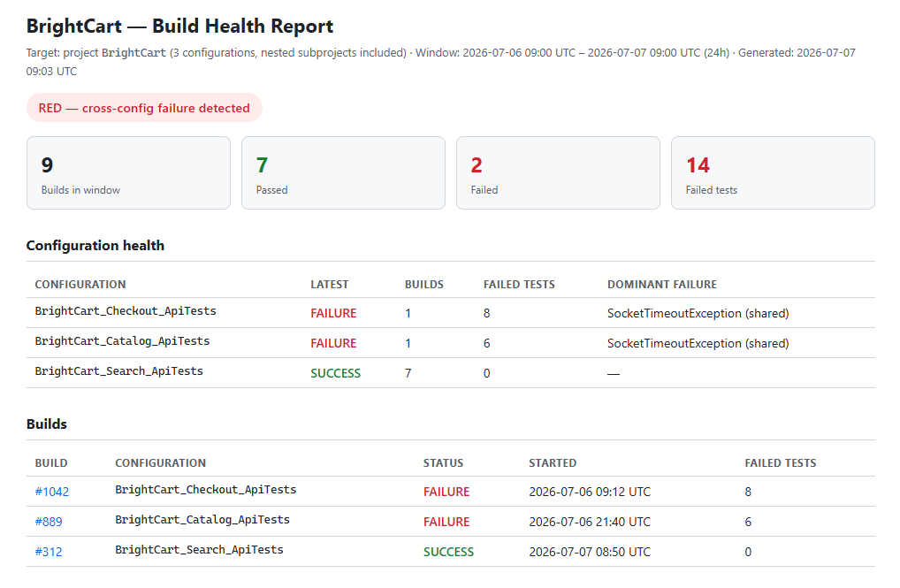
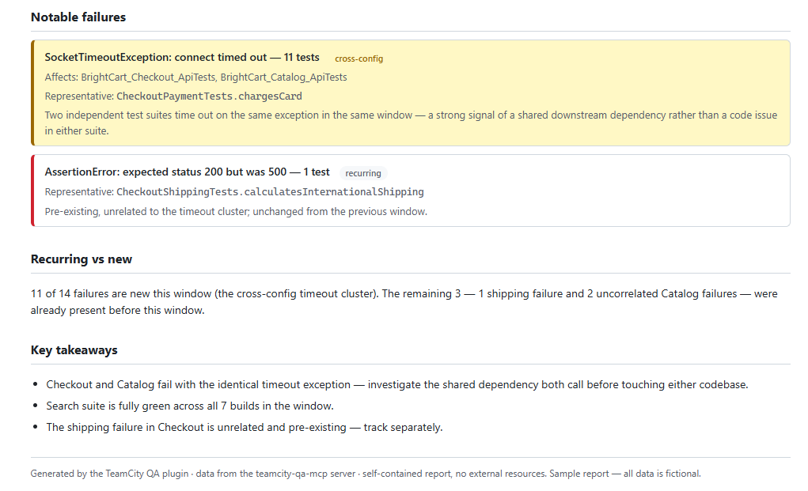

# TeamCity QA Intelligence

[](https://github.com/kate-horshchar/teamcity-qa-mcp/actions/workflows/ci.yml)

> Read-only MCP server for AI-assisted root-cause analysis of TeamCity build failures.
> Package and server name: `teamcity-qa-mcp`.

## The problem

When a CI test run goes red, finding out *why* is manual detective work: open the build, copy stack traces, scan the log, check what changed, compare with the previous build, search whether the same test failed before. For a build with dozens of failures this takes serious time — and most of it is mechanical data gathering, not thinking.

## The solution

This MCP server gives any MCP-compatible AI client structured, compact access to TeamCity data: builds, failed tests, logs, changes, history, diffs. The AI does the reasoning — classifying a failure as a **code change** (with the commit and author), **flaky behavior**, or an **infrastructure problem** — while the server does the data retrieval and normalization. The division of labor is strict: the server never guesses, the AI never scrapes.





*Output of `/generate-report`: eleven of the fourteen failures collapse into one cross-config root cause. All data in this sample is fictional.*

## Is this for you?

**Works well if** your team runs tests on TeamCity, you triage red builds regularly, and a single failure often takes down many tests at once.

**Not for you if** your CI is Jenkins, GitHub Actions, or GitLab — this reads the TeamCity REST API and nothing else. Or if you want automated remediation: it reads and explains, it never fixes or reruns anything.

## Features

- **Read-only by design** — no builds triggered, no tests muted, nothing written to TeamCity. Every API call is a GET. See [Data, permissions & scope](#data-permissions--scope).
- **Multi-config analysis** — aggregate failures across a list of build configurations or a whole project (nested subprojects included), with cross-config root-cause clusters: the same error hitting several configurations at once is a strong infrastructure signal.
- **Flexible targeting** — key tools accept a single build configuration, a list, or a project; with no target they use the configured default.
- **Root-cause clustering** — "43 failures" becomes "1 root cause: AuthException 503, affects 43 tests".
- **Compact JSON responses** optimized for LLM consumption; graceful degradation when data is unavailable.
- **Claude plugin included** ([`plugin/`](plugin/README.md)) — slash commands for triage, comparison, flaky review, and a self-contained HTML health report.
- **Prompts for any MCP client** ([`prompts/`](prompts/README.md)) — the same workflows as ready-to-paste prompts for Cursor, VS Code Copilot, JetBrains AI, and others.
- **stdio transport** — works with Claude Code, Claude Desktop, Cursor, and any other MCP-compatible client.

## Requirements

- **Node.js 20 or newer**
- **An MCP-compatible AI client** — Claude Code, Claude Desktop, Cursor, VS Code Copilot, JetBrains AI, or any other
- **A TeamCity server** whose REST API is reachable from your machine
- **A TeamCity access token** — see [Configuration](#configuration)
- **About 10 minutes** for the whole setup

## Installation

One command for Claude Code — everything is configured inline:

```bash
claude mcp add --scope user --transport stdio teamcity-qa-mcp \
  --env TEAMCITY_URL=https://your-teamcity.com \
  --env TEAMCITY_TOKEN=your-token \
  --env TEAMCITY_BUILD_TYPE_ID=Your_BuildConfig_Id \
  -- npx -y teamcity-qa-mcp
```

No cloning, no source code, no `.env` file needed.

> **Scope options:** `--scope user` makes the server available across all projects. Use `--scope project` to share config via `.mcp.json` in the repo, or omit the flag for local (current project only).

<details>
<summary>Install from GitHub instead of npm</summary>

If your network blocks the public npm registry but allows GitHub, use a git reference as the package source:

```bash
claude mcp add --scope user --transport stdio teamcity-qa-mcp \
  --env TEAMCITY_URL=https://your-teamcity.com \
  --env TEAMCITY_TOKEN=your-token \
  --env TEAMCITY_BUILD_TYPE_ID=Your_BuildConfig_Id \
  -- npx -y git+https://github.com/kate-horshchar/teamcity-qa-mcp.git
```

This needs `git` on your machine and compiles TypeScript locally, so it is slower than the npm install.

</details>

### Claude Desktop

```bash
npx -y teamcity-qa-mcp setup-desktop \
  --url https://your-teamcity.com \
  --token your-token \
  --build-type Your_BuildConfig_Id
```

Then restart Claude Desktop.

### Claude plugin (optional)

This repository is also a plugin marketplace. In Claude Code:

```
/plugin marketplace add kate-horshchar/teamcity-qa-mcp
/plugin install teamcity-qa@teamcity-qa-mcp
```

See [`plugin/README.md`](plugin/README.md) for the command list and Cowork organization install; non-Claude clients can use [`prompts/`](prompts/README.md) instead.

<details>
<summary>Run from a clone (for development)</summary>

```bash
git clone https://github.com/kate-horshchar/teamcity-qa-mcp.git
cd teamcity-qa-mcp
npm install                # also compiles TypeScript into dist/
cp .env.example .env       # Windows: copy .env.example .env
```

Register the local build with an absolute path, passing the same three environment variables as above:

```bash
claude mcp add --transport stdio teamcity-qa-mcp \
  --env TEAMCITY_URL=https://your-teamcity.com \
  --env TEAMCITY_TOKEN=your-token \
  --env TEAMCITY_BUILD_TYPE_ID=Your_BuildConfig_Id \
  -- node /absolute/path/to/teamcity-qa-mcp/dist/index.js
```

The `.env` file is used by the smoke test, which verifies the connection without an AI client:

```bash
npx tsx scripts/smoke-test.ts
```

</details>

## Configuration

| Variable | Required | Default | Description |
|---|---|---|---|
| `TEAMCITY_URL` | Yes | — | TeamCity server URL |
| `TEAMCITY_TOKEN` | Yes | — | Personal API token (Bearer) |
| `TEAMCITY_BUILD_TYPE_ID` | Yes | — | Default build configuration to analyze |
| `TEAMCITY_DEFAULT_LOOKBACK_BUILDS` | No | 20 | Number of recent builds to fetch |
| `TEAMCITY_LOG_TAIL_LINES` | No | 200 | Lines to include in log tail excerpt |
| `TEAMCITY_SIMILAR_FAILURES_LIMIT` | No | 10 | Max similar failures to return |

### How to get your TeamCity API token

1. Log in to your TeamCity instance
2. Navigate to your profile settings → **Access Tokens**
3. Create a new token and copy the value — you will not see it again
4. Put it in your MCP client configuration (the `--env` flag above) or in a `.env` file

TeamCity tokens inherit the permissions of the account that creates them — there is no read-only switch on the token itself. Create the token from an account whose role on the target projects is view-only; the built-in *Project viewer* role is enough for everything this server does.

## Data, permissions & scope

**What it reads.** Builds and their status, test results and failure messages, stack traces, build logs, and the commits associated with a build. Every request is a `GET`.

**What leaves your machine.** The server talks only to your TeamCity instance. But the data it returns is handed to your AI client, which sends it to whichever model provider that client uses — so build logs, stack traces, commit messages and author names are part of what you share with that provider. Point the server at build configurations you are comfortable sharing that way.

**Where credentials live.** The token comes from environment variables in your AI client's MCP configuration. `set_auth_token` and `set_build_type_id` update it at runtime and write the new value to the config files they find — `~/.claude.json`, `claude_desktop_config.json`, and a `.env` in the current directory. They only touch keys that already exist in those files.

**What it never does.** Never triggers a build. Never mutes, ignores, or edits a test. Never writes anything to TeamCity. No telemetry, no analytics, no external service of any kind.

## Available Tools

<details>
<summary>Full tool reference</summary>

### Build discovery
| Tool | Description |
|---|---|
| `list_recent_builds` | List recent builds; optionally filter by status and target another config, a list of configs, or a whole project |
| `get_build_by_id` | Get detailed info for a specific build (trigger, agent, revisions) |
| `get_build_tests` | Browse tests of any build (incl. green ones) with status/name/class filters and pagination |

### Failure investigation
| Tool | Description |
|---|---|
| `get_build_problems` | Get structured build-level problems |
| `get_failed_tests` | Get failed test occurrences for a build |
| `get_test_failure_details` | Get failure message, stack trace, expected/actual values for one test |
| `get_build_log_excerpt` | Get a compact log excerpt (tail + error windows), or regex-search the full log |
| `get_build_changes` | Get commits/changes associated with a build |

### History & patterns
| Tool | Description |
|---|---|
| `get_test_history` | Get recent execution history for a test — the flaky-detection backbone |
| `cluster_build_failures` | Group failed tests of a build by root cause |
| `find_failure_across_builds` | Check whether a failure pattern appeared in previous builds (firstSeen/lastSeen); supports config/list/project targets |

### Aggregated analysis contexts
| Tool | Description |
|---|---|
| `get_build_summary` | Compact summary card for a build: status, problem count, failed test count |
| `compare_builds` | Full diff of any two builds: new/fixed/persistent failures, missing/new tests, ignored changes |
| `get_failed_build_analysis_context` | One-call context for a failed build: clustered failures, changes, log excerpt, auto-comparison with previous green |
| `get_green_build_diff_context` | One-call context for comparing green builds: grouped diff, changes, neighboring-build validation |

### Multi-config analysis
| Tool | Description |
|---|---|
| `list_project_build_configs` | List all build configurations of a project, nested subprojects included |
| `get_multi_config_failure_summary` | Aggregate failure summary across a config / list / project: overall counts, cross-config root-cause clusters, per-config breakdown; 24h window by default |

### Runtime configuration
| Tool | Description |
|---|---|
| `set_build_type_id` | Switch the default build configuration at runtime (persists to found config files) |
| `set_auth_token` | Update the TeamCity token at runtime (persists to found config files) |

</details>

## Documentation & examples

- [Getting started](docs/getting-started.md) — from zero to the first analysis
- [Root cause detection](docs/root-cause-detection.md) — how the AI separates code changes, flaky tests, and infrastructure
- [Multi-config analysis](docs/multi-config.md) — targets, aggregation, and cost controls
- [Claude plugin](plugin/README.md) — installation and commands
- [Examples](examples/) — anonymized end-to-end scenarios, including a [sample HTML report](examples/sample-report.html)

## Feedback

Ideas, feedback, and bug reports are welcome — [open an issue](https://github.com/kate-horshchar/teamcity-qa-mcp/issues/new/choose).

If you are trying it for the first time, the most useful thing you can report is where [Getting started](docs/getting-started.md) broke down for you.

## Roadmap

Unfinished items and new ideas live in [GitHub Issues](https://github.com/kate-horshchar/teamcity-qa-mcp/issues) (`enhancement`, `good first issue`).

| Item | Status |
|---|---|
| Branch-aware analysis (filter builds/tests by VCS branch) | Planned |
| Config-scoped test history (optional target for `get_test_history`) | Planned |
| Configurable root-cause clustering rules | Planned |

## Versioning & releases

Semantic versioning; `package.json` is the single source of the version. Every release is a git tag with notes in [CHANGELOG.md](CHANGELOG.md) and a [GitHub Release](https://github.com/kate-horshchar/teamcity-qa-mcp/releases). Release process: [RELEASING.md](RELEASING.md).
