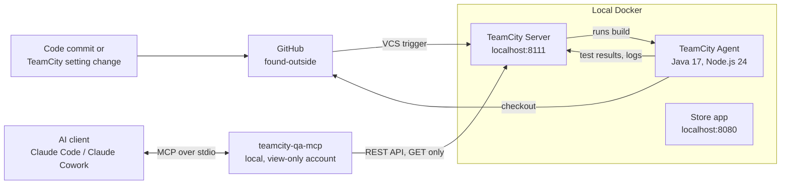

# Demo Environment and Failure Scenarios

## 1. Purpose

To show and test TeamCity QA Intelligence on real builds, I built a small demo environment:
a store application, automated tests and a local TeamCity with two build configurations.
The store is only a test target. Its code is in a separate repository:
[found-outside](https://github.com/kate-horshchar/found-outside).

In each scenario I break the build in a different way on purpose and then ask an AI client,
connected to TeamCity through the MCP server, to find the root cause.

## 2. Environment overview

| Component | Where | Purpose |
|---|---|---|
| Store app | Docker Compose, `http://localhost:8080` | React + Spring Boot store, the system under test |
| TeamCity Server | Docker, `http://localhost:8111` | CI server |
| TeamCity Agent | Docker | Builds the store and runs the tests |
| Build configuration "API Tests" | TeamCity project `FoundOutside` | All 13 API tests on every commit to `main` |
| Build configuration "Smoke Tests" | TeamCity project `FoundOutside` | Health, product and quote tests (9) on every commit to `main` |
| MCP server | Local process started by the AI client | Read-only access to TeamCity through a view-only account |
| AI client | Claude Code or Claude Cowork | Runs the investigation |

Setup instructions: [found-outside README](https://github.com/kate-horshchar/found-outside#readme)
and [teamcity/README.md](https://github.com/kate-horshchar/found-outside/blob/main/teamcity/README.md).

## 3. Green baseline

Before each scenario the system is in a working state:
- the latest "API Tests" build is green with 13 of 13 tests passed;
- the latest "Smoke Tests" build is green with 9 of 9 tests passed;
- the store works in the browser.

## 4. Scenarios

### Scenario 1 — Code regression hidden in a refactoring

**What changes.** A commit titled *"refactor: extract pricing constants"* moves the heavy-item
fee values in `StoreService.java` into constants. It looks like a safe refactoring, but the
condition changes from `>= 2000` to `> 2000`. An item that weighs exactly 2000 g no longer gets
the $5 heavy-item fee.

**How it is triggered.** The commit is pushed to `main`; the VCS trigger starts both build configurations.

**What TeamCity shows.**
- The test step fails. "API Tests": 2 failed, 11 passed.
- Both failures are in `QuoteApiTest` (`calculatesReferenceCartTotals`,
  `appliesHeavyFeeAtBoundaryAndPerUnit`) with the same message: `expected: <500> but was: <0>`.
- "Smoke Tests" fails on the same two tests.

**Expected root cause.** The changed boundary condition in that commit.

**What the investigation found.** One failure cluster, new since the last green build. The only
change between the green and the red build is this commit, which touches `StoreService.java`.
Conclusion: the commit broke a pricing value that should be 500 cents. High confidence in the
commit; the exact line was not visible, because TeamCity does not expose diff content.

**MCP capabilities shown.** Failure clustering, comparison with the last green build, change
attribution, test history.

**Reset.** Revert the commit; both configurations turn green again.

### Scenario 2 — Dependency upgrade breaks the build before tests run

**What changes.** A commit titled *"build: upgrade Spring Boot to 4.1.1"* changes only
`backend/pom.xml`: Spring Boot 3.5.16 → 4.1.1. This is a major upgrade, and the code is not
migrated.

**How it is triggered.** The commit is pushed to `main`; the VCS trigger starts both build configurations.

**What TeamCity shows.**
- The "Build backend" step fails with Java compile errors, and the test step does not run.
- 0 tests, no failed tests. The only build problem is the step's exit code.
- The log shows missing packages: `com.fasterxml.jackson.databind`,
  `com.fasterxml.jackson.core.type`, `org.springframework.boot.web.servlet.error`.

**Expected root cause.** Spring Boot 4 uses Jackson 3 and moved `ErrorController`, so the
existing code no longer compiles.

**What the investigation found.** The failure is in "Build backend", no tests ran, and the
build has one change: the `pom.xml` commit. All errors are missing Spring and Jackson packages,
and the Maven plugin versions changed compared with the last green build. Conclusion: a Spring
Boot major upgrade without code migration. High confidence.

**MCP capabilities shown.** Investigating a build-level failure without test results: build
problems, log excerpt and log search, change attribution, comparing logs of a green and a red build.

**Reset.** Revert the commit; both configurations turn green again.

### Scenario 3 — Configuration drift across two build configurations

**What changes.** Nothing in the code. In TeamCity, the project parameter `env.TAX_RATE_PERCENT`
is renamed to `env.SALES_TAX_RATE_PERCENT`. The store needs `TAX_RATE_PERCENT` to calculate
quotes and orders.

**How it is triggered.** Both build configurations are started from TeamCity.

**What TeamCity shows.**
- Both configurations are red, with no new commits.
- "API Tests": 6 failed, 7 passed. "Smoke Tests": 3 failed, 6 passed.
- Failures look different: `expected: <200> but was: <500>` (also 201 and 409), and
  `NullPointerException`. Health and product tests pass.
- The log contains `WARN Required setting TAX_RATE_PERCENT is missing or invalid`.

**Expected root cause.** The missing `TAX_RATE_PERCENT` setting, shared by both configurations.

**What the investigation found.** Both configurations fail with the same failure groups. The red
builds ran the same revision on the same agent as the green builds before them, with no changes,
and only the red builds log the `TAX_RATE_PERCENT` warning. Conclusion: one shared configuration
or environment cause, not code (High confidence), specifically the missing `TAX_RATE_PERCENT`
(Medium-High). Where the setting was changed was not visible, because the MCP does not expose
build parameters.

**MCP capabilities shown.** Multi-configuration analysis across a whole project, and telling a
configuration problem apart from a code problem.

**Reset.** Rename the parameter back and run both configurations; both turn green.

## 5. Differences at a glance

| | Scenario 1 | Scenario 2 | Scenario 3 |
|---|---|---|---|
| Source of the problem | Code commit | Build file commit | TeamCity setting |
| New commits in the build | 1 | 1 | none |
| Where the build fails | Test step | Build backend step | Test step |
| Tests | 2 failed | 0 run | 6 + 3 failed |
| Configurations affected | both | both | both, one shared cause |
| Key evidence | New failure cluster + one commit | Compile errors + one `pom.xml` commit | Same failures in both configs + no changes + warning in log |
| Main MCP capability | Change attribution | Build-level failure analysis | Multi-config analysis |

## 6. Running the demo

1. Start the store and the TeamCity stack (see the setup links above).
2. Check that the latest builds of both configurations are green.
3. Trigger one scenario and wait for the red builds.
4. Ask the AI client in plain words, for example:
   - *"The latest API Tests build in TeamCity failed. Find out why."*
   - *"Why did the latest build fail?"*
   - *"Both build configurations in the FoundOutside project are red. Are the failures related, and what is the root cause?"*
5. Compare the answer with the expected root cause.
6. Reset the scenario and confirm both configurations are green.

How these scenarios were used to validate the tool:
[DESIGN_AND_TESTING.md, section 14](DESIGN_AND_TESTING.md#14-end-to-end-validation-against-known-root-causes).
