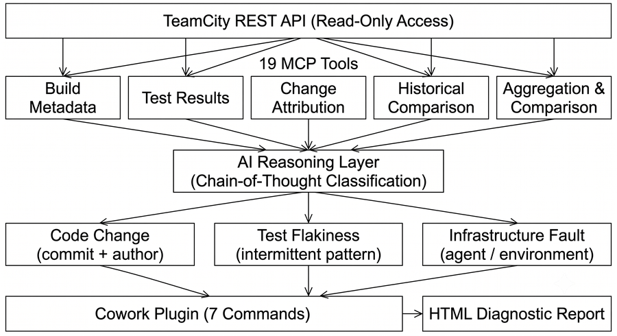
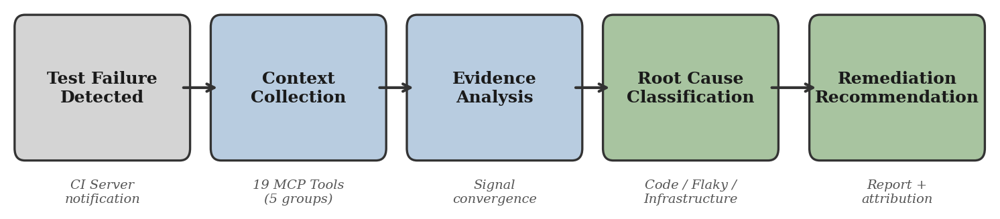
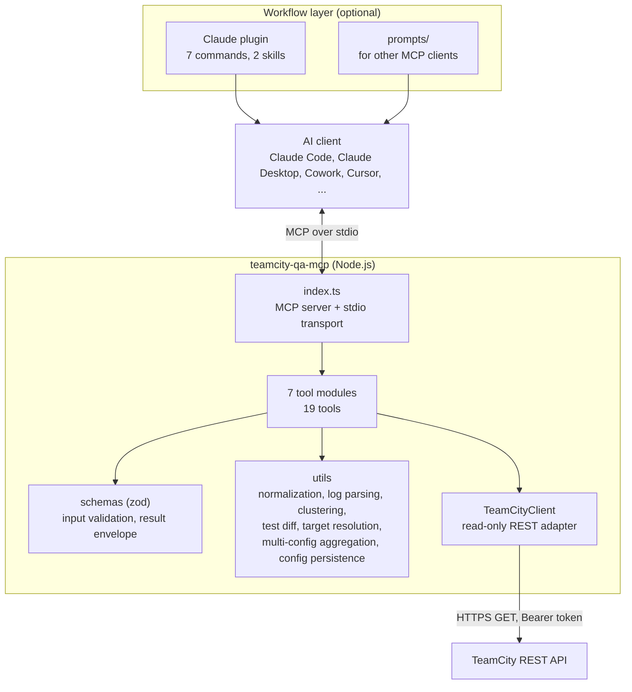

# Design and Testing Document

This document covers the design and testing of **TeamCity QA Intelligence** (`teamcity-qa-mcp`),
my Capstone deliverable, and of the demo environment I built to validate it
([found-outside](https://github.com/kate-horshchar/found-outside)).

- Part 1 — Design: architecture, decisions, patterns, technologies, deployment, security
- Part 2 — Testing: all testing done, how and why

---

# Part 1 — Design

## 1. System overview

TeamCity QA Intelligence is a read-only MCP server. It connects an AI client to the TeamCity
REST API, so the AI can investigate why a build failed. The server collects and normalizes the
evidence: builds, failed tests, stack traces, logs, commits, history and comparisons. The AI
client does the reasoning and classifies each failure as a **code change**, **flaky test** or
**infrastructure problem**, following the rules in the plugin's `qa-analysis` skill.

**Why I built it.** When I started in March 2026, the existing TeamCity MCP servers were
general-purpose: they help an AI control TeamCity (builds, configurations, agents), and one of
them exposes more than 80 tools. JetBrains added a built-in MCP endpoint in TeamCity 2026.1 in
May 2026, after my first release, and it is also focused on working with TeamCity itself. None
of them was focused on investigating test failures.

**More than an API wrapper.** The TeamCity REST API returns raw data. The server turns it into
diagnostic evidence: it groups failed tests by a shared root cause, compares a red build with
the last green one, extracts the relevant part of long logs, checks whether a failure happened
before, finds causes shared across build configurations, and returns all of this in a single call.

I already use this tool in my daily QA work on a production TeamCity instance.

*Figure 1. Architecture of the MCP-based test failure diagnostic system (conceptual view).
Source: Horshchar, 2026 [1].*

*Figure 2. Diagnostic process of TeamCity QA Intelligence. Source: Horshchar, 2026 [1].*

Figure 1 is the conceptual view. Section 3 shows how the code is actually structured.

## 2. Design goals

- **Read-only.** The tool investigates; it never changes builds, tests, agents or settings.
- **Built for QA engineers and developers**, not for CI administration.
- **Token-efficient.** Responses are compact JSON, so an AI client can work with large builds.
- **Client-agnostic.** Works with any MCP-compatible AI client.
- **No infrastructure.** Nothing to host or maintain.
- **Honest about evidence.** Facts are separated from inference; "insufficient history" is a valid answer.

## 3. Architecture

Tools are grouped by investigation step:

| Module | Tools | Question it answers |
|---|---|---|
| `build-discovery` | `list_recent_builds`, `get_build_by_id`, `get_build_tests` | Which build, what ran? |
| `failure-investigation` | `get_build_problems`, `get_failed_tests`, `get_test_failure_details`, `get_build_log_excerpt` | What failed and how? |
| `debugging-context` | `get_build_changes` | What changed? |
| `history-tools` | `get_test_history`, `cluster_build_failures`, `find_failure_across_builds` | Has this happened before? Is it one cause? |
| `aggregate-tools` | `get_build_summary`, `compare_builds`, `get_failed_build_analysis_context`, `get_green_build_diff_context` | Everything in one call |
| `multi-config-tools` | `list_project_build_configs`, `get_multi_config_failure_summary` | Is the same problem in other configurations? |
| `config-tools` | `set_build_type_id`, `set_auth_token` | Runtime configuration |

**How a tool call works:** the MCP SDK validates the input against a zod schema; the tool calls
one or more `TeamCityClient` methods; utils normalize the raw TeamCity JSON into compact records;
the tool returns `{ ok: true, data }` or `{ ok: false, error }`.

## 4. Design decisions

| Decision | Reason |
|---|---|
| Build on the Model Context Protocol | One server works with any MCP-compatible AI client; no custom connector per client. |
| TypeScript on Node.js | Easy distribution through npm: users run it with one `npx` command. |
| stdio transport | This is how local AI clients start MCP servers; there is nothing to host, and the token stays on the user's machine. |
| Read-only: only `GET` requests to TeamCity | It is a tool for QA engineers and developers to investigate tests, not a DevOps tool for managing builds or agents. It is also safer: MCP security research (Hou et al., 2025, discussed in [1]) recommends read-only access for CI data. The only writes are `set_*` tools updating local MCP client config files. |
| The server gathers evidence, the AI reasons | There is no classifier inside the server. The reasoning is transparent and can be checked against the tool responses. |
| Compact normalized JSON and one-call context tools | Keeps token usage and TeamCity API load low. |
| Graceful degradation | If a build log cannot be downloaded, the tool returns a marked "unavailable" result instead of failing the whole investigation. |
| Cost controls for multi-config analysis | Time window (default 24 h), builds per configuration (default 10) and "new failures only" keep project-wide responses small. |
| Flexible targeting with a safe default | Tools accept one configuration, a list or a project; without a target the behavior is exactly as before (covered by a test). |
| Single source of truth | Version lives only in `package.json`; `prompts/` are generated from the plugin; tests fail on drift. |
| Self-contained HTML report | Inline CSS, no JavaScript, no external requests, so a report can be archived and shared safely. |
| View-only TeamCity account | TeamCity tokens inherit the account's permissions, so the account itself must be view-only. |

## 5. Software and architectural patterns

### MCP server

| Pattern | Where | Why |
|---|---|---|
| Layered architecture | transport → tools → utils → client | Each layer changes independently; everything TeamCity-specific sits in the client layer. |
| Adapter / Gateway | `TeamCityClient` | Hides REST endpoints, locators, auth, the 30-second timeout and API errors from the rest of the code. |
| Facade | `get_failed_build_analysis_context`, `get_green_build_diff_context`, `get_multi_config_failure_summary` | One call replaces many, so the AI needs fewer round-trips. |
| Modular registration | `registerXTools(server, client, config)` per module | A new tool group does not touch the others. |
| Result envelope | `success()` / `failure()` in `schemas/common.ts` | Every tool answers in the same shape, so errors are easy for the AI to interpret. |
| Data mapping / normalization | `utils/normalization.ts` | Raw TeamCity JSON becomes small, stable records. |
| Dependency passing | client and config passed into modules | Logic can be tested with a stub client (target resolution tests). |
| Code generation from one source | `scripts/build-prompts.ts` | Prompts for other clients are generated from the plugin, never edited by hand. |

### Demo application

| Pattern | Where | Why |
|---|---|---|
| Layered Controller → Service | `StoreController`, `StoreService` | Pricing, tax, stock and validation rules live in one place and are tested through the API. |
| Centralized error handling | `ApiExceptionHandler` | One stable JSON error format for all API errors. |
| SPA served by the backend | React bundle inside the Spring Boot JAR | One deployable, same origin, no CORS. |
| Multi-stage Docker build | `Dockerfile` | Build tools stay out of the runtime image; tests run as a build gate; the app runs as a non-root user. |
| Configuration from the environment | `TAX_RATE_PERCENT`, no default | A missing setting is visible instead of hidden by a default. |

## 6. Technologies

### MCP server

| Technology | Used for | Reason |
|---|---|---|
| TypeScript, Node.js 20+ | Server | Easy npm / `npx` distribution |
| `@modelcontextprotocol/sdk` | MCP protocol and stdio transport | Official MCP SDK |
| zod | Tool input schemas | Validation and parameter descriptions the AI client sees |
| vitest | Unit and consistency tests | Fast, works with TypeScript and ES modules |
| tsx | Scripts (prompt generation, smoke test) | Runs TypeScript directly |
| GitHub Actions | CI | Runs next to the repository, free for public repos |
| npm registry | Distribution | One-command install |

### Demo environment

| Technology | Used for | Reason |
|---|---|---|
| Java 17, Spring Boot 3.5 | Store backend and API | Familiar stack, installed JDK |
| React 19, Vite | Storefront | Plain React with a small router; nothing more is needed |
| JUnit 5, REST Assured | API integration tests | Real HTTP calls; JUnit XML that TeamCity imports natively |
| Maven Wrapper (checksum pinned), npm lockfile | Builds | Reproducible builds on any machine and on the agent |
| Docker, Docker Compose | App and TeamCity stack | Same environment everywhere, easy reset |
| TeamCity 2026.1.4 (Server + Agent in Docker) | CI system the MCP analyzes | The platform the tool targets; a stable bugfix release |
| In-memory storage | Store data | Deterministic state: a restart resets everything |

## 7. Deployment options and relative cost

| Option | How | Relative cost | Best for |
|---|---|---|---|
| **1. Local, from npm (current, recommended)** | `npx -y teamcity-qa-mcp` in each engineer's AI client | No hosting cost. Each engineer uses their own token. | Individuals and teams; works with on-premises TeamCity (including behind a VPN) and TeamCity Cloud, as long as the REST API is reachable from the engineer's machine |
| 2. Local, from GitHub | Same, installed from the Git repository | No hosting cost; slower install | Networks that block the npm registry |
| 3. Shared remote server, on-premises *(future work)* | MCP over Streamable HTTP on an internal server next to TeamCity | Uses existing hardware, but adds authentication, secret management and maintenance work | Teams that want one shared setup with TeamCity behind a firewall |
| 4. Shared remote server, in the cloud *(future work)* | Same, on a cloud VM or container service | Monthly hosting cost, plus authentication and network access to TeamCity | Teams using TeamCity Cloud |

In every option the main running cost is **AI client usage** (a subscription or API tokens),
not the MCP server. This is why responses are compact and multi-config analysis has cost controls.

**Demo environment:** runs locally with Docker Compose. It is a test target, not a product.
TeamCity Server runs with a 2 GB heap, which is more than typical free hosting tiers offer. The
store could be hosted on a free tier without code changes, but this was not needed.

## 8. Security and data handling

- Every TeamCity request is a `GET`. No telemetry, no other external services.
- Data returned by the tools (logs, stack traces, commit messages, author names) goes to the AI
  client and from there to its model provider. Users should point the server only at builds
  they are allowed to share this way.
- The token comes from the MCP client's configuration. `set_auth_token` and `set_build_type_id`
  update only keys that already exist in local config files.
- The demo uses a separate `mcp-viewer` account with the *Project viewer* role. I verified that
  read endpoints work and administrative endpoints return 403.

---

# Part 2 — Testing

## 9. Testing strategy

| Level | What is tested | Tooling | When it runs | Why |
|---|---|---|---|---|
| Unit | Target resolution, multi-config aggregation, config persistence | vitest | Locally and in CI | Logic that can break silently; no TeamCity needed |
| Consistency | README lists every tool; prompts match the plugin; HTML template is self-contained | vitest | Locally and in CI | Docs, prompts and templates are part of the product; drift is a bug |
| CI | Build and all tests on Node.js 20 and 22 | GitHub Actions | Every push to `main` and every pull request | Both supported Node versions stay green |
| Smoke | Connection and authentication to a real TeamCity | `scripts/smoke-test.ts` | Manually | Checks configuration without an AI client |
| API integration (demo) | Store API behavior | JUnit 5, REST Assured | Docker build, local Maven, TeamCity | Real HTTP behavior of the system under test |
| CI pipeline (demo) | Build and tests of the store on every commit | TeamCity, 2 build configurations | Every commit to `main` | Produces the real builds the MCP investigates |
| End-to-end validation | AI client + MCP find the correct root cause | Claude Code with MCP tools only | Once per failure scenario | Tests the actual goal of the product |

## 10. MCP unit and consistency tests

83 tests in 6 files, run with `npm ci && npm run build && npx vitest run`.

| File | What it checks |
|---|---|
| `target-resolution.test.ts` | At most one target is accepted and empty values are rejected; falls back to the default configuration; lists are de-duplicated; a project expands into its configurations; a project without configurations is an error; the default locator stays byte-identical (backward compatibility) |
| `multi-config-aggregation.test.ts` | TeamCity date format and time window; which statuses count as failed; build counts per configuration; errors isolated per configuration; cross-config clusters (only causes seen in 2+ configurations, sorted); new failures compared with a baseline; build sorting |
| `config-persistence.test.ts` | Updating the token and build configuration in Claude Code / Claude Desktop JSON and `.env`; other servers, comments and special characters preserved; missing files or keys handled safely |
| `report-template.test.ts` | HTML template has no JavaScript and loads no external resources, CSS or fonts; placeholders stay intact; the sample report is fully filled in |
| `prompts-sync.test.ts` | `prompts/` exactly matches the generated output; every prompt is self-contained |
| `docs-sync.test.ts` | README mentions every registered tool and does not hardcode the tool count |

## 11. CI and smoke test

**GitHub Actions** (`.github/workflows/ci.yml`): checkout → Node.js setup with npm cache →
`npm ci` → `npm run build` (TypeScript compile) → `npx vitest run`, on Node.js 20.x and 22.x.
The CI badge is shown in the README.

**Smoke test** (`npx tsx scripts/smoke-test.ts`): loads `.env`, connects to TeamCity, and lists
recent and failed builds. It fails fast if the URL or token is wrong.

## 12. Demo application tests

13 API integration tests. Each one starts the real Spring Boot application on a random port and
calls it over HTTP.

| Class | Tests | Focus |
|---|---|---|
| `HealthApiTest` | 1 | Application starts and reports healthy |
| `ProductApiTest` | 4 | Catalogue listing, filtering and sorting, product details, 404/400 errors |
| `QuoteApiTest` | 4 | Cart totals, heavy-item fee at the 2000 g boundary, stock in quotes, validation |
| `OrderApiTest` | 4 | Order creation, retrieval, email validation, stock rule without partial changes |

- **Isolation:** a fresh application context for every test method, so no state leaks between tests.
- **Determinism:** no random data, no sleeps, no external services, no browser.
- **Realistic configuration:** `TAX_RATE_PERCENT` is read from the environment exactly as in
  production, with no test default. A configuration problem therefore shows up in the tests.
- **Why API level:** all business rules live in the backend, and the failure scenarios target
  the backend and the build.
- **No frontend tests:** the storefront only presents data; this was out of the demo scope.
  I checked the UI manually in the browser.
- **Docker build as a test gate:** the image build runs `mvnw clean verify`, so a failing test
  fails the image build.

## 13. TeamCity pipeline (demo)

| Step | Command |
|---|---|
| 1. Install dependencies | `npm ci` |
| 2. Build frontend | `npm run build` |
| 3. Build backend | `mvnw clean package -DskipTests` |
| 4. Run tests | `mvnw surefire:test` |

- JUnit XML reports are imported once through XML report processing.
- VCS trigger on `main` (checked every 60 seconds); 10-minute execution timeout.
- Two build configurations: **API Tests** (all 13 tests) and **Smoke Tests** (Health, Product and
  Quote tests, 9 in total).
- `env.TAX_RATE_PERCENT` is defined on project level and inherited by both configurations.
- The agent runs in Docker with Java 17 and Node.js 24. Setup:
  [found-outside/teamcity/README.md](https://github.com/kate-horshchar/found-outside/blob/main/teamcity/README.md).

## 14. End-to-end validation against known root causes

Unit tests cannot show whether the AI client, using the MCP, finds the **right** root cause. So
I tested the whole system on failures where the answer was known in advance.

**Method**
1. Start from a green build.
2. Introduce one controlled failure with a documented expected root cause. The notes are kept
   outside the repository and outside the TeamCity checkout.
3. Confirm in TeamCity that the build failed as intended.
4. Run a blind investigation: Claude Code in non-interactive mode with only the MCP tools, a
   view-only token and the runtime config tools blocked. No access to the code, files, shell
   or scenario notes. The same report structure every time: summary, timeline, tools used,
   root cause, confidence, alternatives, limitations.
5. Compare the report with the expected root cause and rate it.
6. Revert the change and confirm the build is green again.

**Results**

| Scenario | What TeamCity showed | Expected root cause | What the investigation found | Rating |
|---|---|---|---|---|
| 1. Code regression | 2 failed tests, `expected: <500> but was: <0>` | Commit "refactor: extract pricing constants" changed the heavy-item fee condition in `StoreService.java` from `>= 2000` to `> 2000` | The commit, the file, and that a fee value dropped to 0. The exact operator was not visible, because TeamCity does not expose diff content. | Strongly narrowed |
| 2. Dependency upgrade | "Build backend" step failed, 0 tests ran | Spring Boot 3.5.16 → 4.1.1 in `pom.xml` without migrating the code (Jackson 3 packages, moved `ErrorController`) | The failing step, the single `pom.xml` commit, the missing packages, and the Boot 4 migration as the cause | Exact (High confidence) |
| 3. Configuration drift across two configurations | Both configurations red with no code change (6 and 3 failed tests) | Project parameter `env.TAX_RATE_PERCENT` renamed in TeamCity | One shared cause in both configurations; configuration, not code; `TAX_RATE_PERCENT` missing. Where it was changed was not visible, because parameters are not exposed. | Exact (High for shared config cause, Medium-High for the exact setting) |

Scenario details: [DEMO_SCENARIOS.md](DEMO_SCENARIOS.md). The limitations found in these runs are
listed in section 16.

## 15. Test gaps

- `TeamCityClient`, the tool handlers, and log parsing, normalization, clustering and test diff
  have no direct unit tests. They are covered by the end-to-end runs against a real TeamCity.
  Unit tests with mocked TeamCity responses are a next step.
- The demo storefront has no automated UI tests.

---

# Known limitations and next steps

## 16. Limitations confirmed during validation

- **No build parameters, agent environment or artifacts.** Configuration drift can be detected
  only indirectly, through its effects (scenario 3).
- **No diff content.** Changed file paths are available, but the changed lines are not (scenario 1).
- **`find_failure_across_builds` searches test and problem messages, not build logs**, so a
  compile error cannot be tracked across builds this way (scenario 2).
- **Log excerpts** can miss some error lines outside the log tail, and regex search can return
  fewer matches than it reports (scenario 2).
- **Analysis context in multi-config projects** can compare a build with a green build from a
  different configuration and report false "missing tests" (scenario 3).
- **Failed tests are capped at 100** per build.
- **No branch filtering**, and test history by name mixes results from different configurations.

## Next steps

Planned work is tracked in [GitHub Issues](https://github.com/kate-horshchar/teamcity-qa-mcp/issues):
branch-aware analysis (#1), config-scoped test history (#2), configurable clustering rules (#3),
documenting supported TeamCity versions (#4). Other candidates: unit tests with mocked TeamCity
responses and a shared remote deployment over Streamable HTTP.

## References

[1] Horshchar, K. (2026). Beyond Flaky Test Detection: Using the Model Context Protocol for
Intelligent Test Failure Diagnosis in CI/CD. *Central European Journal of Science and Research
(Stredoevropsky Vestnik pro Vedu a Vyzkum)*, Vol. 1, No. 8. ISSN 2336-3630.
https://doi.org/10.65237/2336-3630-2026-8(1)-3 —
[article page](https://phes.com.ua/ojs/index.php/www/en/article/view/239). Licensed under CC BY 4.0.
